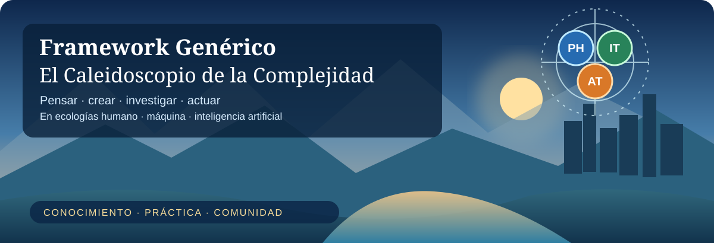
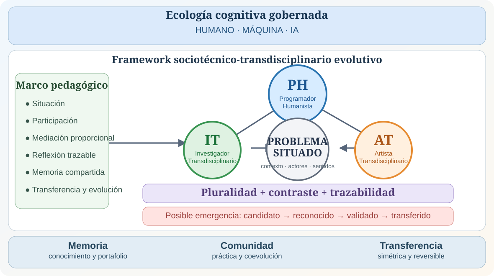
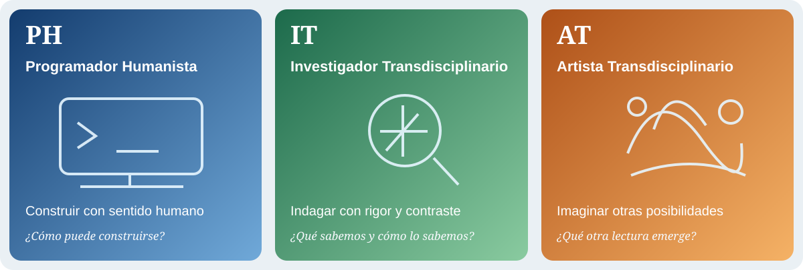
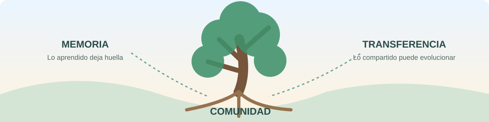

# 🌐 Framework Genérico v5.2.0
## El Caleidoscopio de la Complejidad



**Conocimiento · práctica · comunidad · futuros posibles**

*Un ecosistema para pensar, crear, investigar y actuar en ecologías humano · máquina · IA.*

> Los problemas complejos rara vez caben en una sola disciplina, una sola herramienta o una sola cabeza. Este Framework crea un espacio donde distintas formas de conocer y actuar pueden encontrarse, contrastarse, dejar memoria y evolucionar sin perder responsabilidad humana.

Bienvenido. Si llegaste aquí por curiosidad, por investigación, por docencia, por tecnología, por creación artística o porque tienes un problema que no sabe respetar fronteras disciplinares, estás en el lugar correcto. 🧭

Este repositorio no intenta darte una receta universal. Te ofrece una **arquitectura evolutiva** para trabajar con complejidad de forma trazable, humana y transferible.

## 🚪 Elige tu puerta de entrada

- 🌐 **Aplicación V5:** https://ricardojuanmorales.github.io/framework-proyecto-generico-ia-1/v5/
- 📦 **Releases estables:** https://github.com/ricardojuanmorales/framework-proyecto-generico-ia-1/releases
- 📚 **Repositorio maestro:** https://github.com/ricardojuanmorales/framework-proyecto-generico-ia-1
- 🏛️ **V4 histórica:** https://ricardojuanmorales.github.io/framework-proyecto-generico-ia-1/v4/
- 📜 **Notas de release v5.2.0:** [Arquitectura Conceptual Integrada](18_DOCUMENTACION_ACTIVA/Cierres_Reportes/2026-10-09_GitHub_Release_Framework_V5_2_0.md)
- 🧬 **Arquitectura conceptual integrada:** `02_ARQUITECTURA_CONCEPTUAL/Arquitecturas_Referencia/2026-10-08_Arquitectura_Conceptual_Integrada_Framework_Canon_v1_0.md`

```text
framework: 5.2.0
architecture: LOCAL_FIRST
backend_required: false
cloud_required: false
account_required: false
telemetry_default: false
external_AI_required: false
```

## 🧭 Una brújula antes de comenzar

Imagina un problema que no cabe en una facultad, una profesión o una herramienta. En vez de obligarlo a encajar, el Framework ofrece un **espacio compartido para explorar perspectivas**, discutirlas, actuar y conservar memoria de lo aprendido.

### La idea en tres líneas

```text
PERFIL = lente
FRAMEWORK = espacio operativo y evolutivo
PROBLEMA = centro
```

El Framework es un **sistema sociotécnico-transdisciplinario evolutivo**. Organiza relaciones entre problemas reales, personas, conocimientos, prácticas, máquinas, inteligencia artificial, memoria, gobernanza y transferencia.

No es solo una app. No es solo un repositorio. No es una metodología lineal. Es el sistema completo que permite que esas piezas trabajen juntas sin confundirse unas con otras.

### Cuatro escenas de una posibilidad

> **1 · El problema llama.** Una comunidad necesita explorar un desafío educativo, tecnológico o ambiental. Ninguna persona posee todas las respuestas.
>
> **2 · Llegan las lentes.** PH se pregunta qué construir responsablemente; IT, qué evidencia sostiene nuestras afirmaciones; AT, qué dimensiones podemos percibir o expresar de otro modo.
>
> **3 · Surgen tensiones.** Las perspectivas se contrastan y modifican interpretaciones. La diferencia enriquece el proceso; lo novedoso aún debe validarse.
>
> **4 · Queda memoria.** Se registran decisiones, dudas, artefactos y aprendizajes. Lo situado puede retornar al Framework como conocimiento candidato.

*Historia ilustrativa de posibilidades, no un caso empírico ni una promesa de emergencia.*

## 🌱 ¿Para qué sirve?

Puede ayudar a una persona, equipo o comunidad a:

- formular mejor un problema complejo;
- combinar conocimiento común y especializado sin borrarlos;
- decidir cuándo una IA ayuda y cuándo sustituye demasiado;
- conservar decisiones, evidencia, dudas y aprendizajes;
- relacionar investigación, tecnología, arte y formación;
- crear proyectos trazables y transferibles;
- aprender de implementaciones reales sin convertir cada experiencia en dogma;
- y construir, con el tiempo, una **comunidad de práctica** capaz de aprender de sí misma.

El Framework no promete automáticamente una comunidad de práctica. Crea condiciones para que pueda emerger mediante participación sostenida, memoria compartida, contraste, colaboración y evolución colectiva.

> **comunidad disponible ≠ comunidad de práctica consolidada**

## 🧬 Figura 1 · El mapa de relaciones



*Adaptación editorial esquemática para lectura web basada en la Figura 1 de la ponencia de los autores. No reemplaza la figura académica original ni el canon documental.*

**Lee el mapa:** el problema situado convoca lentes diferentes dentro de una ecología cognitiva gobernada. Pluralidad, contraste y trazabilidad permiten investigar una **posible** emergencia caleidoscópica. Memoria, comunidad y transferencia sostienen el aprendizaje y la continuidad.

## 🧬 El ADN conceptual

La referencia principal es:

`02_ARQUITECTURA_CONCEPTUAL/Arquitecturas_Referencia/2026-10-08_Arquitectura_Conceptual_Integrada_Framework_Canon_v1_0.md`

Allí se fija la arquitectura conceptual vigente, incluida una idea central:

> **Canon no significa eternidad. Significa referencia vigente, explícita, trazable y revisable.**

La verdad del Framework no se trata como una piedra tallada. Es una verdad **versionada, contrastable y evolutiva**. Lo que hoy se considera canónico puede revisarse mañana si nueva evidencia, práctica o reflexión lo exige, pero el sistema debe conservar la memoria de cómo y por qué cambió.

## 🧠 El Marco Teórico Longitudinal

Debajo de las prácticas y herramientas existe una capa más profunda: el **Marco Teórico Longitudinal**.

Surge de un repositorio curado de fuentes fundacionales de Educación General organizado en cuatro grandes áreas. Su función no es decorar el Framework con teoría, sino mantener abiertas y trazables las grandes preguntas humanas:

- ¿qué significa conocer?;
- ¿qué podemos delegar?;
- ¿qué responsabilidad no debe disolverse?;
- ¿qué cuenta como evidencia?;
- ¿cómo cambia la autoridad cuando interviene IA?;
- ¿cómo protegemos agencia, pluralidad y capacidad de revisión?

El Marco Teórico Longitudinal alimenta el patrimonio común, dialoga con los conocimientos especializados de los perfiles y con la base federada de conocimiento, y proporciona el fondo desde el cual se revisan los principios del sistema.

## 🎓 Del marco profundo a la práctica

El **Marco Pedagógico** es una traducción operacional vigente de ese fundamento longitudinal.

Sus seis principios actuales son:

1. situación antes que abstracción;
2. participación antes que consumo;
3. mediación proporcional;
4. reflexión trazable sobre la acción;
5. memoria compartida;
6. transferencia y evolución.

```text
SITUAR
→ PARTICIPAR
→ MEDIAR
→ PRODUCIR
→ REFLEXIONAR
→ RECORDAR
→ TRANSFERIR
→ EVOLUCIONAR
↺
```

Los seis principios no agotan el Marco Teórico Longitudinal. Son su implementación pedagógica vigente y pueden evolucionar.

## 🔭 Las tres lentes: identidades que hacen preguntas diferentes



Son **lentes funcionales y capacidades de actuación**, no profesiones rígidas, agentes ni casillas obligatorias. Una persona puede activar varias; un equipo puede distribuirlas; un problema puede requerir solo algunas. Ninguna gobierna jerárquicamente a las demás.

| Lente | Contribución propia | Pregunta |
|---|---|---|
| 🔵 **PH** | Construir mediaciones tecnológicas responsables | ¿Cómo puede construirse? |
| 🟢 **IT** | Interrogar conocimiento, evidencia y validez | ¿Qué sabemos y cómo lo sabemos? |
| 🟠 **AT** | Investigar mediante percepción y creación | ¿Qué otra configuración revela el problema? |


### 🔵 PH · Programador Humanista

**Identidad.** Transforma intención humana en mediación tecnológica comprensible, sostenible y responsable. No es únicamente «quien programa»: hace visibles los supuestos y consecuencias humanas de las decisiones técnicas.

**Capacidades.** Arquitectura, diseño, programación, implementación, interoperabilidad, automatización proporcional, experiencia de uso, accesibilidad, seguridad, privacidad, mantenibilidad y sostenibilidad.

Preguntas típicas:
- ¿podemos construirlo?;
- ¿cómo debe funcionar?;
- ¿qué decisiones técnicas tienen consecuencias humanas?;
- ¿cómo evitamos que la tecnología opaque el propósito?

### 🟢 IT · Investigador Transdisciplinario

**Identidad.** Investiga cómo se construyen, contrastan y justifican afirmaciones en situaciones complejas. Gobierna epistemológicamente **su contribución** y aporta vigilancia al trabajo colectivo, sin imponerse a las otras lentes.

**Capacidades.** Preguntas y problemas de investigación, métodos, fuentes y procedencia, análisis, síntesis, incertidumbre, triangulación, contraste, interpretación, validación y reconocimiento de límites.

Preguntas típicas:
- ¿qué sabemos?;
- ¿cómo lo sabemos?;
- ¿qué no sabemos?;
- ¿qué afirmación necesita más contraste?

### 🟠 AT · Artista Transdisciplinario

**Identidad.** Produce conocimiento mediante percepción, imaginación, simbolización, materialidad y experiencia. No decora resultados terminados: puede transformar cómo el problema se reconoce, se representa y se experimenta.

**Capacidades.** Investigación-creación, sensibilidad, narrativas, visualización, simbolización, materialidad, representación multimodal, prototipado expresivo, interpretación cultural y diseño de experiencias.

Preguntas típicas:
- ¿qué todavía no estamos viendo?;
- ¿cómo cambia el problema si lo representamos de otra manera?;
- ¿qué dimensión sensible, simbólica o material permanece oculta?

Una persona puede activar más de una lente. Un equipo puede distribuirlas. No siempre se necesitan las tres.

```text
PH + IT + AT != Caleidoscopio automático
```

El valor está en el **contraste real** entre perspectivas suficientemente distintas. Un desacuerdo fundamentado puede ser más fértil que un consenso apresurado.

> **Tres lentes no son tres formularios que completar.** Son maneras de conocer y actuar que pueden transformarse mutuamente sin perder su identidad.

## 🔮 El Caleidoscopio de la Complejidad

El Caleidoscopio no es un cuarto perfil. Es una **posible propiedad emergente**.

Puede reconocerse cuando existen, como mínimo:

```text
situación real
+ pluralidad
+ contraste efectivo
+ emergencia de algo nuevo
+ trazabilidad
```

Estados propuestos:

```text
Candidato → Reconocido → Validado → Transferido
```

Novedad no significa verdad. Validez local no significa universalidad. Transferencia no significa canonización automática.

## 🗂️ 00–21 + 99: el cuerpo del Framework

La macroestructura **00–21 + 99** no es solamente una colección de carpetas ni una gramática documental.

Es el **cuerpo estructural, operativo y memorial del Framework**.

Cada cartapacio conserva un segmento de la realidad del proceso. Solo unidos permiten reconstruir relaciones entre conocimiento, decisiones, evidencia, prácticas, artefactos, gobernanza, memoria y evolución.

> **Cada segmento preserva una dimensión del proceso; su articulación constituye el cuerpo evolutivo del Framework.**

La estructura lógica es estable, pero cada proyecto activa solo lo que necesita. No hay premio por llenar carpetas vacías. Hay valor en conservar estructura suficiente para entender qué ocurrió, por qué ocurrió y qué puede transferirse.

## 📚 Una ecología del conocimiento

El Framework distingue:

- **Patrimonio epistemológico común:** conocimiento vigente disponible transversalmente.
- **Conocimiento especializado:** saberes, métodos y artefactos propios de PH, IT y AT.
- **Base federada de conocimiento:** acceso a conocimiento distribuido sin exigir centralización.
- **Conocimiento situado:** aprendizajes producidos en una implementación concreta.

Un conocimiento puede:

```text
permanecer especializado
→ circular
→ contrastarse
→ convertirse en candidato compartido
→ validarse
→ eventualmente incorporarse al patrimonio común
```

Pero no tiene que hacerlo.

```text
Memoria != canon
Aporte != conocimiento validado
Registro != verdad
```

## 🧳 El Portafolio: orientación humana dentro de la complejidad

El **PORTAFOLIO** no es la Base de Conocimiento.

Pertenece a la implementación situada y ayuda a cada participante a conservar su trayectoria dentro del sistema:

- decisiones;
- dudas;
- tensiones;
- cambios de interpretación;
- artefactos;
- elecciones de lente;
- justificaciones;
- aprendizajes.

> **La macroestructura preserva la continuidad del sistema; el Portafolio preserva la continuidad de la experiencia humana dentro del sistema.**

Esa memoria situada puede ayudar a estudiar cuándo y cómo aparece una transformación caleidoscópica.

## 🤖 Humano · máquina · IA

El Framework trabaja con una **ecología cognitiva gobernada**, no con una división rígida del trabajo.

```text
Framework → estructura y reglas
IA        → analiza, contrasta y genera alternativas
Máquina   → ejecuta, registra, persiste y evidencia
Humano    → interpreta, decide, autoriza y responde
```

La cognición puede distribuirse. La responsabilidad no debe evaporarse.

> **human oversight ≠ human agency**

La agencia exige comprender, cuestionar, decidir, justificar, revisar y reabrir.



## 🔁 Transferencia simétrica reversible

```text
Framework ↔ Proyecto
```

El Framework puede llevar a un proyecto principios, estructuras, conocimiento, métodos y artefactos. El proyecto puede devolver hallazgos, tensiones, contraejemplos, mejoras y nuevo conocimiento situado.

Pero lo que vuelve no entra automáticamente al canon.

```text
experiencia situada
→ aprendizaje candidato
→ contraste
→ gate humano
→ permanecer local | especializarse | integrarse
```

La transferencia es **simétrica** porque ambos lados pueden transformarse y **reversible** porque ningún aprendizaje local obtiene autoridad permanente por defecto.

## 🧩 Las materializaciones

| Pieza | Qué hace |
|---|---|
| **Framework** | sistema completo, principios, arquitectura, memoria y gobernanza |
| **Repositorio maestro** | fuente canónica y memoria evolutiva |
| **00–21 + 99** | cuerpo estructural, operativo y memorial |
| **Paquete autosostenido** | incorpora el Framework de forma portable |
| **Repositorio del proyecto** | conserva la verdad versionada de esa implementación |
| **App** | superficie operativa para START, INTEGRATE y AUDIT |
| **Release** | fotografía reproducible de un estado estable |
| **Portafolio** | memoria situada del participante |
| **Transferencia reversible** | conecta aprendizaje local y evolución del Framework |

```text
Framework maestro
→ paquete autosostenido
→ proyecto real
↔ app
→ práctica + evidencia + Portafolio
→ aprendizaje candidato
→ transferencia simétrica reversible
→ posible evolución del Framework
```

## 🖥️ Tres puertas operativas: START · INTEGRATE · AUDIT

No son niveles de experiencia. Son tres relaciones posibles con un proyecto.

### START
Crear una implementación desde cero.

### INTEGRATE
Incorporar el Framework a un proyecto existente sin forzarlo a reorganizarse por completo.

### AUDIT
Contrastar un proyecto maduro mediante estado, evidencia e historia relevante.

La aplicación ayuda con activación, Portafolio, decisiones humanas, conocimiento, transferencias, candidatos caleidoscópicos y exportación/importación.

> El proyecto debe poder salir de la aplicación sin salir del Framework.

## 🧑‍🤝‍🧑 Hacia una comunidad de práctica

La ambición comunitaria del Framework no consiste en acumular usuarios.

Consiste en que personas y equipos puedan:

- compartir repertorios sin borrar diferencias;
- aprender de casos ajenos sin copiar contextos;
- conservar procedencia;
- debatir principios;
- contrastar patrones;
- devolver mejoras;
- reconocer errores;
- y transformar el propio Framework.

Una comunidad de práctica real aparecería cuando exista participación sostenida y un repertorio compartido que evoluciona mediante uso, discusión y retorno de experiencia.

Esto significa que tú no necesitas “dominar el Framework” antes de participar. Puedes entrar desde un problema, una lente, un proyecto, una pregunta, un artefacto o una crítica bien trazada.

## 🌳 Estudios Generales: raíz y laboratorio

Estudios Generales ocupa un lugar especial porque reúne humanidades, ciencias, arte, tecnología, cultura, ciudadanía y reflexión ética alrededor de problemas que desbordan fronteras disciplinares.

En este ecosistema puede funcionar como:

- raíz del Marco Teórico Longitudinal;
- espacio de integración epistemológica;
- laboratorio de ecologías cognitivas humano–máquina–IA;
- espacio de formación;
- y lugar de retorno y revisión.

No es el único contexto posible ni se afirma superioridad empírica. Es un territorio especialmente fértil para investigar cómo aprendemos, creamos y respondemos ante complejidad.

## 🚀 Tu primera expedición: empieza sin perderte

No necesitas leer los 23 cartapacios antes de hacer algo útil.

Empieza con cinco preguntas:

```text
1. ¿Cuál es el problema real?
2. ¿Por qué importa y para quién?
3. ¿Qué lentes hacen falta ahora?
4. ¿Qué evidencia demostraría avance?
5. ¿Qué decisiones necesitan responsabilidad humana explícita?
```

Después elige:

```text
START | INTEGRATE | AUDIT
```

y activa solo lo necesario.

### Rutas recomendadas

- **Quiero entender la arquitectura:** empieza por el documento canónico integrado en Cartapacio 02.
- **Quiero usarlo en un proyecto:** abre la aplicación o el paquete autosostenido.
- **Quiero comprender los perfiles:** explora Cartapacio 05 y los perfiles transversales en Cartapacio 02.
- **Quiero investigar evidencia:** ve a Cartapacio 13.
- **Quiero entender transferencia/comunidad:** ve a Cartapacio 14.
- **Quiero documentación humana:** ve a Cartapacio 21.
- **Quiero estudiar cómo evolucionó:** revisa Cartapacio 20 y 99_ARCHIVO_HISTORICO.

## 📖 Documentación y rutas canónicas

- Arquitectura Conceptual Integrada: `02_ARQUITECTURA_CONCEPTUAL/Arquitecturas_Referencia/2026-10-08_Arquitectura_Conceptual_Integrada_Framework_Canon_v1_0.md`
- Guía rápida V5: `21_WIKI_DOCUMENTACION_HUMANA/Guias_Framework_V5/2026-10-06_Guia_Rapida_Usuario_Framework_V5_1_v1_0.md`
- Onboarding usuario/colaborador: `21_WIKI_DOCUMENTACION_HUMANA/Guias_Framework_V5/2026-10-06_Onboarding_Dual_Usuario_Colaborador_Framework_V5_1_v1_0.md`
- Marco Pedagógico: `12_DISENO_INSTRUCCIONAL_UNIVERSAL/2026-10-05_Marco_Pedagogico_Canonico_Framework_V5_v1_1.md`
- Arquitectura de distribución: `02_ARQUITECTURA_CONCEPTUAL/Arquitecturas_Referencia/2026-10-06_Arquitectura_Distribucion_Framework_Repositorio_Paquete_App_Transferencia_V5_1_0.md`
- Núcleo Integral Autosostenido v5.2.0: `00_CONTROL_MAESTRO/Referecias_Base/2026-10-09_Framework_Generico_V5_2_0_Integral_Autosostenido_v1_0.md`
- Núcleo v5.1.0 (histórico): `00_CONTROL_MAESTRO/Referecias_Base/2026-10-06_Framework_Generico_V5_1_0_Integral_Autosostenido_v1_0.md`
- Auditoría de la transición v5.1.0 → v5.2.0: `18_DOCUMENTACION_ACTIVA/Cierres_Reportes/2026-10-09_Auditoria_Desfase_Framework_V5_2_0.md`

## 📏 Evidencia: lo que existe y lo que aún falta demostrar

El Framework distingue:

```text
N1 descriptivo    → qué existe
N2 arquitectónico → qué intenta favorecer
N3 teórico        → qué relaciones propone
N4 empírico       → qué efectos han sido comprobados
```

Regla de trabajo:

> **describir firmemente · proponer precisamente · hipotetizar modestamente**

Por eso el Framework puede describirse como construido, versionado y operacionalizado, pero todavía debe investigar empíricamente cuestiones como efectividad pedagógica general, agencia preservada, transferencia de aprendizaje, comunidad de práctica consolidada y emergencia caleidoscópica consistente.

## 🏛️ Estado

La versión v5.2.0 consolida la Arquitectura Conceptual Integrada del 8 de octubre de 2026. El esquema de proyectos y el paquete portable conservan su contrato 0.1.0, con compatibilidad para proyectos 5.0.0 y 5.1.0. Las evidencias técnicas finales de publicación deben consultarse en GitHub Actions y en los assets verificables del release.


```text
Framework: 5.2.0
App: 5.2.0
Schema de proyecto: 0.1.0
Paquete portable de proyecto: 0.1.0
Arquitectura: local-first
V4: preservada
V5.0.0 y V5.1.0: preservadas como releases históricos
```

---

## 🌌 Una invitación

Este Framework no pretende ser un edificio terminado. Se parece más a una ciudad que conserva planos, memoria y principios mientras sigue aprendiendo de quienes la habitan.

Puedes entrar para resolver un problema. Puedes quedarte para mejorar una lente. Puedes traer una crítica, un contraejemplo, una nueva forma de representar algo que nadie estaba viendo o una implementación que obligue al sistema a reconsiderarse.

Si el Framework funciona como esperamos, su mejor futuro no será tener más documentación.

Será convertirse en un lugar donde una comunidad aprenda a **pensar mejor junta sin dejar de pensar diferente**.

---

### 🎨 Procedencia visual y transparencia

Las ilustraciones son **recursos editoriales explicativos**, no evidencias empíricas. La adaptación esquemática de la **Figura 1** se basa en la ponencia académica *El Caleidoscopio de la Complejidad*, de Ricardo Juan Morales De Jesús y Manuel de J. Reyes Guzmán. La figura académica original y el documento canónico conservan precedencia conceptual. Los SVG editables se versionan en `21_WIKI_DOCUMENTACION_HUMANA/Recursos_Visuales/README_V5_2/`.

La IA puede apoyar análisis, redacción, programación y creación visual; las decisiones, comprobaciones y responsabilidad permanecen humanas. La existencia de esta arquitectura no demuestra automáticamente efectividad pedagógica, comunidad de práctica consolidada ni emergencia caleidoscópica validada.
