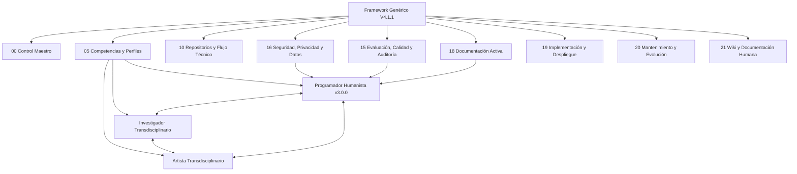
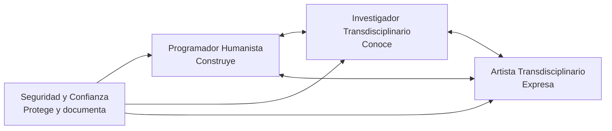
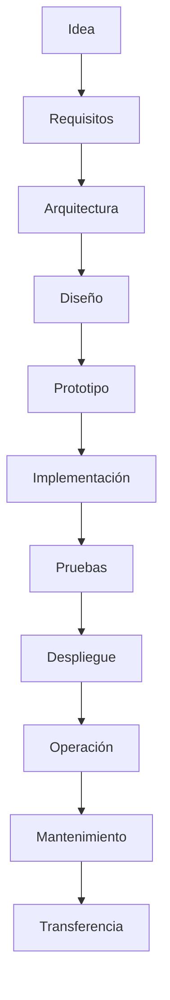

# Framework Genérico V4.1.1
## Ecosistema operativo para perfiles transdisciplinarios con IA

**Estado:** Repositorio operativo vivo  
**Documento maestro estable:** Framework Genérico V4.1.0  
**Versión operativa:** V4.1.1  
**Fecha:** 2026-05-31  
**Perfil activo principal:** Programador Humanista v3.0.0  

---

## 1. ¿Qué es este framework?

Este repositorio organiza un ecosistema de trabajo para crear, documentar, evaluar y transferir perfiles transdisciplinarios apoyados por inteligencia artificial.

El Framework Genérico V4.1.1 permite trabajar con perfiles como:

```text
Programador Humanista
Investigador Transdisciplinario
Artista Transdisciplinario
```

Su propósito no es guardar documentos como fósiles digitales. Su propósito es sostener producción viva: ideas, aplicaciones, investigaciones, experiencias, seguridad, métricas, gobernanza y transferencia.

---

## 2. Vista rápida ilustrada



---

## 3. Perfiles activos

| Perfil | Estado | Función |
|---|---|---|
| Programador Humanista v3.0.0 | Activo, Fase 1 v0.2 | Construye artefactos digitales educativos funcionales, seguros, documentados y transferibles |
| Investigador Transdisciplinario | Preparado para activación | Convierte artefactos y experiencias en evidencia, método, corpus y conocimiento |
| Artista Transdisciplinario | Preparado para activación | Convierte artefactos, datos e IA en experiencia, mediación, lenguaje y sentido |

---

## 4. Fórmula del Programador Humanista

```text
PH = Función + Evidencia + Experiencia + Seguridad + Documentación + Gobernanza + Transferencia
```

Versión humana:

```text
Construir sistemas educativos con humanidad, evidencia, experiencia, seguridad y memoria viva.
```

---

## 5. Tríada de transferencia



Cada producto debe poder responder:

| Capa | Pregunta |
|---|---|
| Técnica | ¿Qué se construye y cómo se mantiene? |
| Investigativa | ¿Qué evidencia produce o qué pregunta permite estudiar? |
| Artística | ¿Qué experiencia genera y cómo comunica sentido? |
| Seguridad y confianza | ¿Qué riesgos controla y qué condiciones exige? |

---

## 6. Seguridad longitudinal

La seguridad no es una fase final. Es una columna vertebral desde el inicio.



Principios activos:

```text
Security by design
Security by default
SSDLC / SSDF
DevSecOps
Codificación segura
Gates técnicos G0-G7
Checklist longitudinal
```

---

## 7. Cartapacios principales

| Cartapacio | Uso |
|---|---|
| `00_CONTROL_MAESTRO/` | Reglas maestras, manifiestos, mapas y protocolos |
| `05_COMPETENCIAS_Y_PERFILES/` | Perfiles activos, competencias y arquitecturas de perfil |
| `09_IA_AGENTES_Y_COPILOTOS/` | IA, asistentes, copilotos y arquitectura futura de agentes |
| `10_REPOSITORIOS_Y_FLUJO_TECNICO/` | Git, lenguajes, APIs, pruebas, code review y flujo técnico |
| `15_EVALUACION_CALIDAD_Y_AUDITORIA/` | Métricas, gates, auditoría y evaluación |
| `16_SEGURIDAD_PRIVACIDAD_Y_DATOS/` | Seguridad, privacidad, datos, secretos y cumplimiento |
| `18_DOCUMENTACION_ACTIVA/` | Bitácoras, changelog, decisiones y continuidad |
| `19_IMPLEMENTACION_Y_DESPLIEGUE/` | Cloud, CI/CD, Docker, IaC, observabilidad y runbooks |
| `20_MANTENIMIENTO_Y_EVOLUCION/` | Deuda técnica, incidentes, soporte, releases y retiro |
| `21_WIKI_DOCUMENTACION_HUMANA/` | Guías humanas, FAQ e inicio rápido |
| `99_ARCHIVO_HISTORICO/` | Versiones cerradas, ciclos completados y archivo histórico |

---

## 8. Cómo usar este repositorio

### Paso 1. Ubicar el perfil

```text
05_COMPETENCIAS_Y_PERFILES/
└── Programador_Humanista/
    └── Perfil_Operativo_v3_0_0/
```

### Paso 2. Leer los documentos rectores

```text
1. Alcance Operativo
2. Mapa Rector
3. Fórmula Nuclear
4. Matriz de Seguridad Longitudinal
5. Matriz de Transferencia Simétrica Triádica
6. Matriz de Competencias
7. Unidades Nucleares
8. Métricas N3/N4
9. Enlaces Espejo
10. Registro de Gobernanza
11. Changelog
```

### Paso 3. Usar enlaces espejo

El perfil mantiene la visión central. Los detalles técnicos viven en cartapacios especializados.

```text
Perfil PH → Enlaces Espejo → Cartapacios técnicos
```

### Paso 4. Documentar cada avance

Toda sesión importante debe dejar bitácora, decisión, changelog, gate, registro de riesgo o enlace espejo.

---

## 9. Gates técnicos mínimos

| Gate | Nombre |
|---|---|
| G0 | Contexto y datos |
| G1 | Arquitectura y diseño seguro |
| G2 | Codificación segura |
| G3 | Dependencias y secretos |
| G4 | Revisión y pruebas |
| G5 | Despliegue seguro |
| G6 | Operación y respuesta |
| G7 | Transferencia y documentación |

---

## 10. Qué no crear todavía

```text
AGENTS.md
CLAUDE.md
SKILLS.md
workflows operativos finales
```

La arquitectura conceptual de agentes puede diseñarse, pero la operación final queda para una fase posterior.

---

## 11. Para iniciar una nueva conversación de transferencia

### Investigador Transdisciplinario

Usar:

```text
Prompt_Activacion_Fase_1_Investigador_Transdisciplinario_2026_05_31_v0_1.md
```

### Artista Transdisciplinario

Usar:

```text
Prompt_Activacion_Fase_1_Artista_Transdisciplinario_2026_05_31_v0_1.md
```

En ambos casos, subir primero los documentos de referencia del paquete rector PH v0.2.

---

## 12. Estado actual del proyecto

```text
Estructura de cartapacios: actualizada y fusionada a main
Paquete rector PH Fase 1 v0.2: producido
Transferencia IT/AT: preparada
Actualización local: pendiente
Commit y push: pendiente
```

---

## 13. Próxima acción recomendada

```bash
git status
git add <archivos_del_paquete>
git commit -m "docs: agregar paquete rector Fase 1 PH v3.0.0 v0.2"
git push origin main
```

Luego registrar cierre de sesión en documentación activa.

---

## 14. Filosofía de uso

Cada documento debe ayudar a que otra persona pueda entender:

```text
qué se hizo,
por qué se hizo,
dónde vive,
cómo se evalúa,
qué riesgos tiene,
cómo se mantiene,
y cómo se transfiere.
```

Un repositorio vivo no es una biblioteca dormida. Es un taller con brújula, casco y bitácora.
